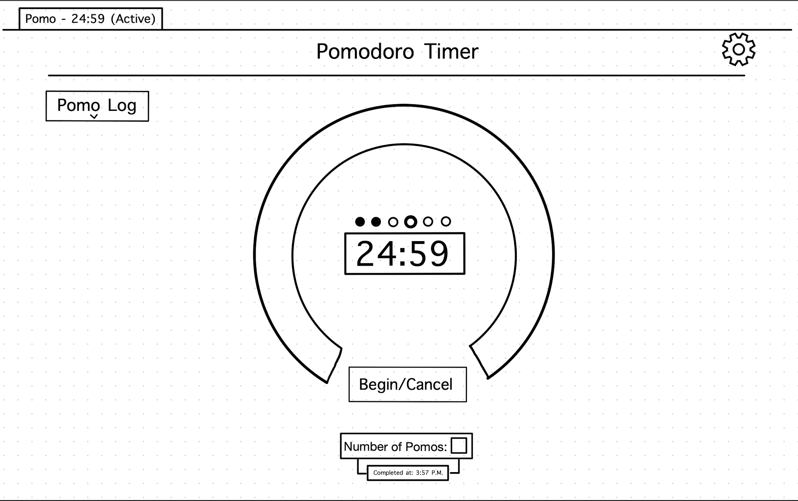

# Wireframe v1

* Status: superceded by [02102021-wireframe](02102021-wireframe.md)
* Deciders: Nir, Anthony, Navid, Matthew, Max, Jerry, Noah
* Date: 2021-02-04

## Context and Problem Statement

We wanted to make a rough outline of what our Pomodoro Timer would look like.

## Decision Drivers

* Need a central timer that tells you the time remaining in this pomo
* Need a begin/cancel button
* Need a menu that logs pomo history
* Need a menu that allows the user to edit settings

## Decision Outcome

* Timer is in the center of the screen, surrounded by a "horseshoe" that fills up clockwise as the timer progresses.
  * During the break, the "horseshoe" becomes much smaller and empties counterclockwise, returning to the state before timer started
  * Transition from one pomo to next is automatic
* Begin/cancel button with a menu that allows you to select the number of pomos you plan to complete
* Pomodoro log is a dropdown on the left
* Settings menu is a dropdown on the top right
* Indicator in the chrome tab about how much time is remaining in pomo.
