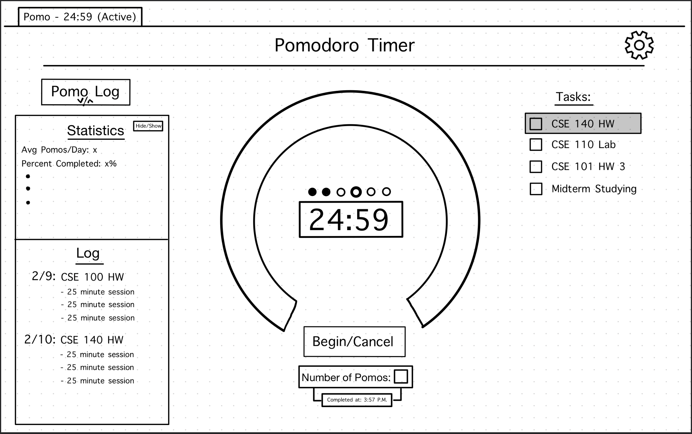

# Wireframe v2

* Status: superceded by [02152021-wireframe](02152021-wireframe.md)
* Deciders: Anthony, Max, Jerry, Noah
* Date: 2021-02-10

## Context and Problem Statement

We needed to modify our design after critique from Sasya, fleshing out our pomo log and adding a task list.

## Decision Drivers

* Need to add design for pomo log
* Need to add a task list

## Decision Outcome

* Pomo log is a dropdown on the left side of the window
  * Top half of log is user statistics, can be toggled hide/show
  * Bottom half of log records the date of a particular pomo session, which task worked on, as well as number of pomos completed.
* Task list is a permanent addition on the right side of the window.
  * When you complete task, click on checkbox, it adds strikethrough
  * Clicking on the text of a task selects it as the current task worked on
  * When page refreshed, completed tasks (with strikethrough) disappear

## Caveats/Workarounds

* Task selection could be confusing, will revisit if necessary.
