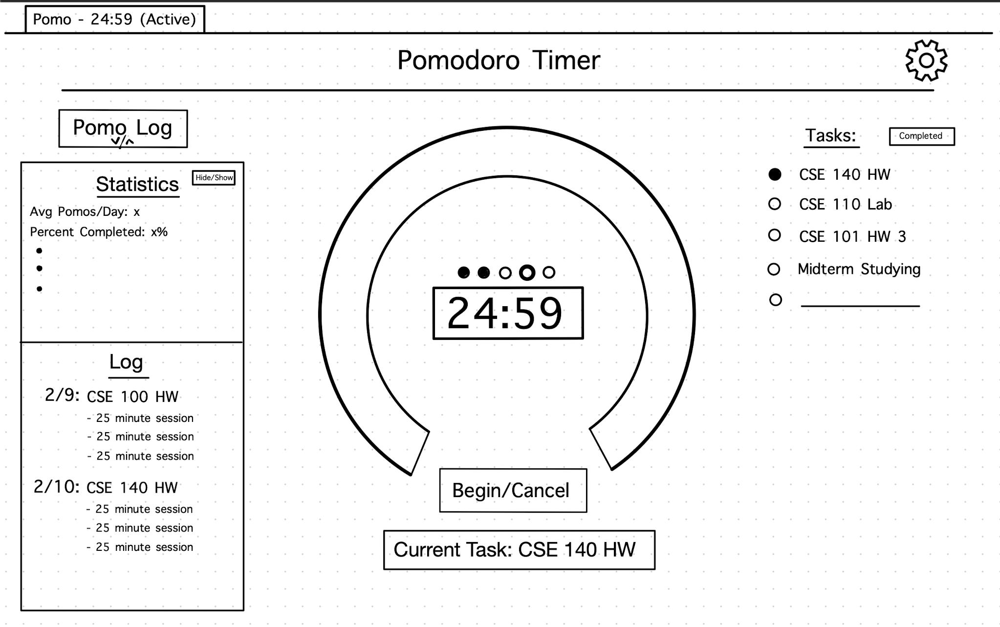

# Wireframe v3

* Status: accepted
* Deciders: Anthony, Max, Jerry, Noah, An, Matthew
* Date: 2021-02-15

## Context and Problem Statement

We needed to modify our task list design and number of pomos due to confusing UI.

## Decision Drivers

* User Interface for task list is confusing
  * It is unclear when one is selecting task to work on versus clearing task
* Dislike selecting number of pomos at start of work session
* Automatically beginning next pomo can lead to unintentional pomos being recorded

## Decision Outcome

* Task list now is a radio button (one highlighted at a time) where the user can select to indicate current task.
  * There is a separate button that indicates completion of a task, and task gets strikethrough like before
  * Empty, underlined space at the bottom of task list for user to enter new task
  * If no tasks in task list, "Unnamed task" will be logged
  * Automatically select first task on list always
* Removed number of pomos selector, now user starts each pomo manually
* Current task is indicated at bottom of page for clarity.
  * If no task selected, contains "None Selected"

## Caveats/Workarounds

* Manually starting each pomo could prove to be laborious and sap user attention, will revisit if necessary.
